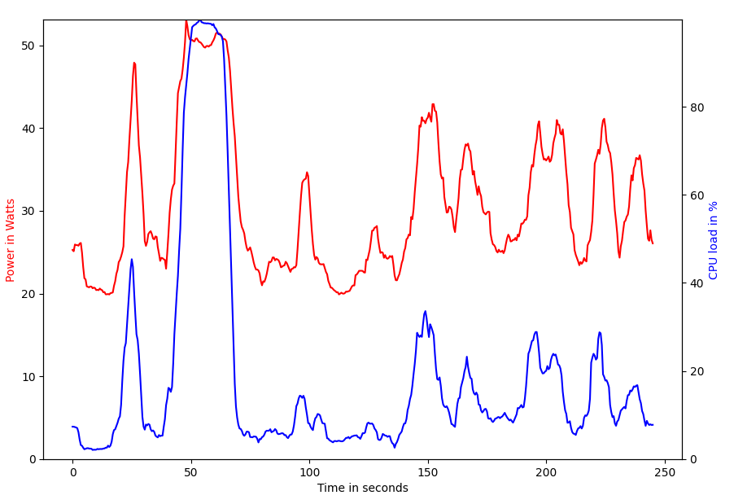

<h1>PowerSpy.py</h1>

You suspect there might be a crypto mining trojan horse on your machine that hides from task-manager? Get a spy to uncover it :)

PowerSpy is a lightweight python program, visualizing the CPU load and the precise electrical power demand of your computer using the VOLTCRAFT SEM6000 bluetooth power consumption meter. It uses the bleak library and is therefore compatible with windows machines. 

The SEM6000 is a lowcost bluetooth power consumption meter produced by VOLTCRAFT: [SEM6000](https://www.conrad.de/de/p/voltcraft-sem6000-energiekosten-messgeraet-bluetooth-schnittstelle-datenexport-datenloggerfunktion-trms-stromtarif-e-1558906.html)

To use it, first install dependencies like matplotlib, numpy and bleak:

````
pip install matplotlib
pip install numpy
pip install bleak
````

Run the application from command terminal. It uses asyncio and will not work in a running event loop when using Spyder or similar.

````
python3 PowerSpy.py
````

The computer shall be plugged into the SEM6000. The SEM6000 shall be in default configuration (Name: Voltcraft, PIN: 0000).
After PowerSpy finds the device, it launches a plot and shows an averaged power consumption / CPU load.

PLugged in SEM6000:<br>


Power and CPU load diagram:<br>

